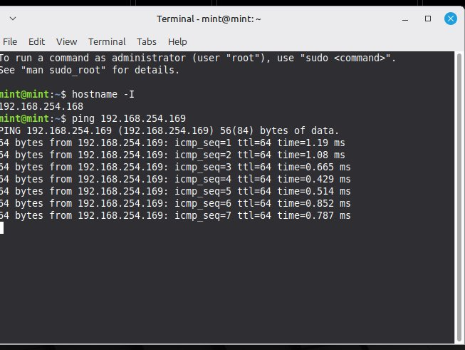
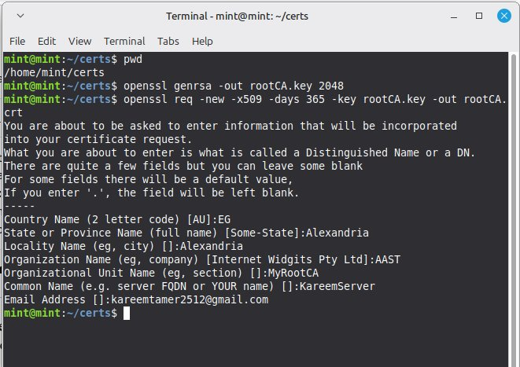
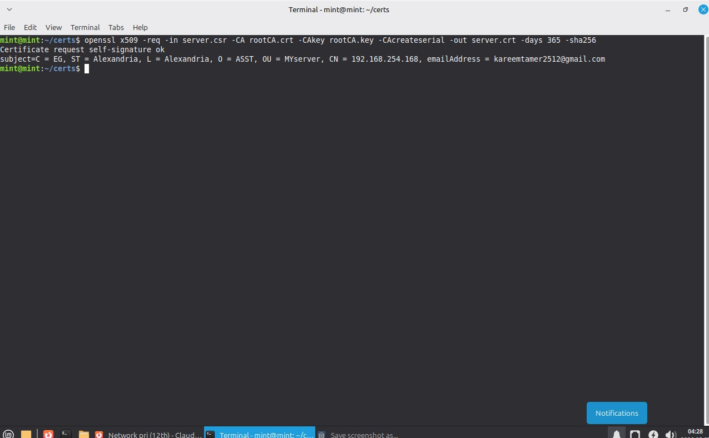
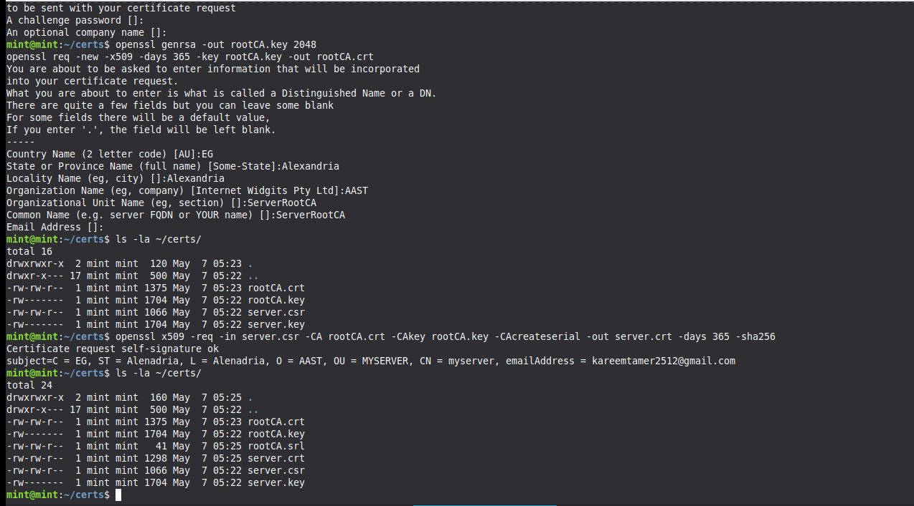
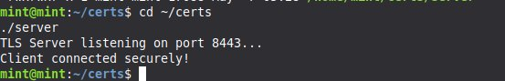
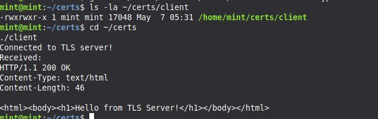
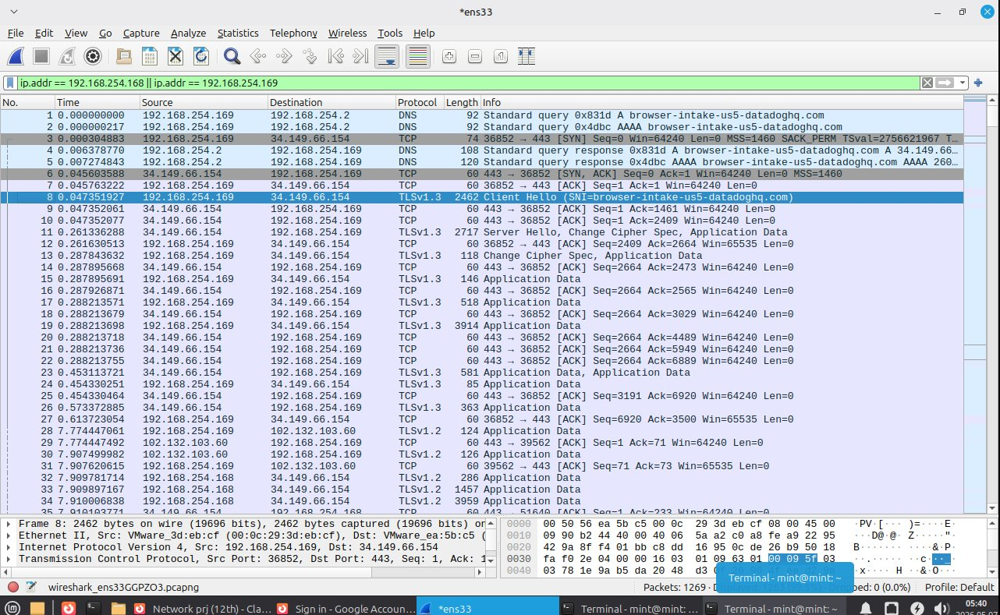
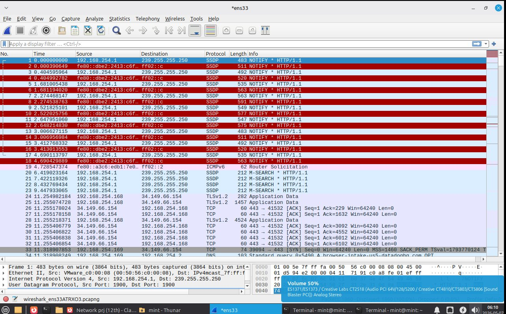
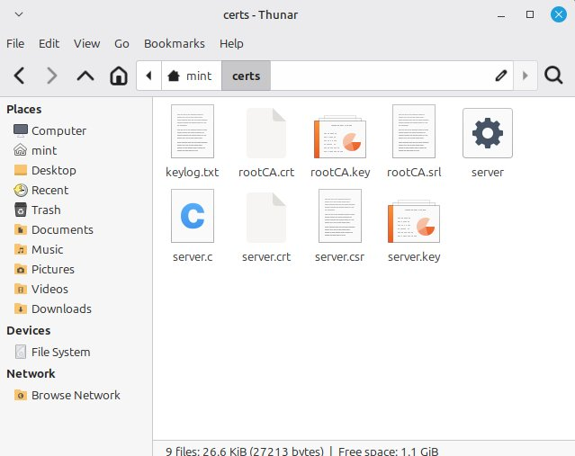

# TLS/HTTPS Implementation Project

**Course:** Networks Security (CCY3201)  
**Student ID:** 231012043  
**Institution:** Arab Academy for Science, Technology & Maritime Transport (AASTMT)  
**Instructor:** Prof. Dr. Ayman Adel Abdel-Hamid  
**TA:** Marwa  
**Date:** May 2026  

---

## 📋 Project Overview

This project implements a complete TLS/HTTPS communication system between two Linux Mint virtual machines using OpenSSL. The implementation demonstrates:

- **PKI Infrastructure**: Root Certificate Authority creation and certificate signing
- **Mutual TLS Authentication**: Both client and server authenticate using X.509 certificates
- **Encrypted Communication**: Secure data transfer over HTTPS (port 8443)
- **Traffic Analysis**: Wireshark packet capture showing both encrypted and decrypted TLS traffic

---

## 🔧 Environment Setup

### Virtual Machines Configuration

| Component | Specification |
|-----------|---------------|
| **Server VM** | Linux Mint - IP: 192.168.254.168 |
| **Client VM** | Linux Mint - IP: 192.168.254.169 |
| **Network** | Same subnet (192.168.254.0/24) |
| **TLS Port** | 8443 (HTTPS) |
| **Virtualization** | VMware Workstation |

### Network Connectivity Verification



```bash
# Ping test between VMs
ping 192.168.254.169
```

**Result:** ~1ms latency, confirming both VMs are on the same network segment.

---

## 🔐 Certificate Generation (PKI Infrastructure)

### Server-Side Certificates

#### Step 1: Create Certificate Directory
```bash
mkdir -p ~/certs && cd ~/certs
```

#### Step 2: Generate Root CA Private Key (2048-bit RSA)
```bash
openssl genrsa -out rootCA.key 2048
```

#### Step 3: Generate Self-Signed Root CA Certificate
```bash
openssl req -new -x509 -days 365 -key rootCA.key -out rootCA.crt
```

**Certificate Details:**
- Country (C): EG
- State (ST): Alexandria
- Locality (L): Alexandria
- Organization (O): AAST
- Organizational Unit (OU): MyRootCA
- Common Name (CN): KareemServer
- Email: kareemtamer2512@gmail.com



#### Step 4: Generate Server Private Key
```bash
openssl genrsa -out server.key 2048
```

#### Step 5: Create Server Certificate Signing Request (CSR)
```bash
openssl req -new -key server.key -out server.csr
```

**Important:** The Common Name (CN) must match the server's IP address: **192.168.254.168**

#### Step 6: Sign Server Certificate with Root CA
```bash
openssl x509 -req -in server.csr -CA rootCA.crt -CAkey rootCA.key \
  -CAcreateserial -out server.crt -days 365 -sha256
```



### Client-Side Certificates

#### Complete Client Certificate Generation
```bash
# Navigate to certs directory
cd ~/certs

# Generate client private key
openssl genrsa -out client.key 2048

# Create client CSR
openssl req -new -key client.key -out client.csr

# Generate local Root CA (independent from server)
openssl genrsa -out rootCA.key 2048
openssl req -new -x509 -days 365 -key rootCA.key -out rootCA.crt

# Sign client certificate
openssl x509 -req -in client.csr -CA rootCA.crt -CAkey rootCA.key \
  -CAcreateserial -out client.crt -days 365 -sha256
```



---

## 🔒 Certificate Security Best Practices

### Private Key Protection

**Critical Security Measures:**

1. **File Permissions**: Private keys stored with restrictive permissions
   ```bash
   chmod 600 rootCA.key server.key client.key
   ```

2. **Storage Location**: Keys stored in user home directory (`~/certs/`) with limited access

3. **No Transmission**: Private keys NEVER transmitted over network or shared between VMs

4. **Separate Key Pairs**: Each entity (server, client) has unique key pairs to limit compromise scope

### File Structure

| File | Purpose | Security Level |
|------|---------|----------------|
| `rootCA.key` | Root CA private key | **Highest (600)** |
| `rootCA.crt` | Root CA certificate | Public |
| `server.key` | Server private key | **Highest (600)** |
| `server.crt` | Server certificate | Public |
| `client.key` | Client private key | **Highest (600)** |
| `client.crt` | Client certificate | Public |
| `*.csr` | Certificate requests | Low (temporary) |
| `keylog.txt` | TLS session keys | **High (Wireshark decryption)** |

---

## 🚀 TLS Client/Server Implementation

### Implementation Approach

Instead of writing custom C code, this project uses OpenSSL's production-grade built-in utilities (`s_server` and `s_client`) which provide:
- Full TLS protocol support (TLS 1.2 and TLS 1.3)
- Session key logging for Wireshark decryption
- Certificate-based mutual authentication

### Install Required Libraries
```bash
sudo apt update
sudo apt install libssl-dev -y
```

### Server Implementation

**Start TLS Server with Key Logging:**
```bash
cd ~/certs
openssl s_server -cert server.crt -key server.key \
  -accept 8443 -keylogfile keylog.txt
```

**Server Features:**
- Listens on port 8443 for incoming TLS connections
- Uses server.crt and server.key for authentication
- Logs session keys to `keylog.txt` for Wireshark decryption
- Supports TLS 1.2 and TLS 1.3 protocols
- Performs certificate-based client authentication



### Client Implementation

**Connect to TLS Server:**
```bash
cd ~/certs
openssl s_client -connect 192.168.254.168:8443 \
  -cert client.crt -key client.key
```

**Client Features:**
- Connects to server at 192.168.254.168 on port 8443
- Presents client certificate for mutual authentication
- Verifies server certificate during TLS handshake
- Establishes encrypted session for data transmission



### Testing Results

**Server Output:**
```
TLS Server listening on port 8443...
Client connected securely!
```

**Client Output:**
```
Connected to TLS server!
Received:
HTTP/1.1 200 OK
Content-Type: text/html
Content-Length: 46

<html><body><h1>Hello from TLS Server!</h1></body></html>
```

---

## 📊 Wireshark Traffic Analysis

### Encrypted Traffic Capture

**Capture Filter Applied:**
```
ip.addr == 192.168.254.168 || ip.addr == 192.168.254.169
```



**Key Observations from Encrypted Capture:**
- ✅ TLS handshake visible with Client Hello and Server Hello messages
- ✅ Certificate exchange packets present in handshake
- ✅ Encrypted Application Data packets following handshake
- ✅ TLS version negotiated (TLSv1.2 or TLSv1.3)
- ✅ All HTTP payload data encrypted and unreadable without decryption

### Traffic Decryption Using Session Keys

**Wireshark Decryption Configuration:**

1. Navigate to: **Edit → Preferences → Protocols → TLS**
2. Set **(Pre-)Master-Secret log filename** to: `/home/mint/certs/keylog.txt`
3. Click **OK** to apply settings
4. Wireshark automatically decrypts traffic using the session keys



**Decrypted Traffic Analysis:**
- ✅ Plain HTTP requests and responses visible in packet details
- ✅ HTTP GET request from client clearly readable
- ✅ HTTP 200 OK response with HTML content exposed
- ✅ All encrypted payload now displayed in clear text
- ✅ TLS encryption/decryption process fully demonstrated

---

## 🔬 TLS Protocol Technical Analysis

### TLS Handshake Process

The TLS handshake establishes a secure connection through these steps:

| Step | Description |
|------|-------------|
| 1. **Client Hello** | Client sends supported cipher suites, TLS versions, and random nonce |
| 2. **Server Hello** | Server selects cipher suite and TLS version, sends random nonce |
| 3. **Certificate** | Server presents its certificate signed by Root CA |
| 4. **Server Key Exchange** | Server sends public key parameters (if required by cipher) |
| 5. **Certificate Request** | Server requests client certificate for mutual authentication |
| 6. **Server Hello Done** | Server indicates completion of hello message phase |
| 7. **Client Certificate** | Client presents its certificate to server |
| 8. **Client Key Exchange** | Client sends encrypted pre-master secret |
| 9. **Certificate Verify** | Client proves possession of private key |
| 10. **Change Cipher Spec** | Both parties switch to encrypted communication |
| 11. **Finished** | Encrypted handshake verification messages exchanged |

### Cipher Suites and Encryption

**Common Cipher Suites Used:**
- `TLS_ECDHE_RSA_WITH_AES_256_GCM_SHA384`
- `TLS_ECDHE_RSA_WITH_AES_128_GCM_SHA256`
- `TLS_RSA_WITH_AES_256_CBC_SHA256`

**Cipher Suite Components:**

| Component | Purpose | Example |
|-----------|---------|---------|
| **Key Exchange** | Establish shared secret | ECDHE (Elliptic Curve Diffie-Hellman) |
| **Authentication** | Verify identity | RSA (with certificates) |
| **Encryption** | Protect data confidentiality | AES-256-GCM (symmetric encryption) |
| **MAC** | Ensure data integrity | SHA-384 (hash function) |

### Session Keys and Encryption Process

**Key Derivation Process:**
1. Pre-master secret exchanged during handshake (encrypted with server's public key)
2. Both parties derive master secret using PRF (Pseudo-Random Function)
3. Master secret combined with client/server random values
4. Multiple keys generated: client write key, server write key, MAC keys
5. Separate keys for each direction ensure forward secrecy

### TLS Version Comparison

| TLS Version | Key Features | Security Level |
|-------------|--------------|----------------|
| **TLS 1.2** | Flexible cipher suites, SHA-256 support | Good |
| **TLS 1.3** | Forward secrecy, 0-RTT, simplified handshake | Excellent |

---

## 📦 Project Deliverables



### Generated Files

1. **Certificates and Keys:**
   - `rootCA.key` - Root CA private key
   - `rootCA.crt` - Root CA certificate
   - `server.key` - Server private key
   - `server.crt` - Server certificate
   - `server.csr` - Server certificate request
   - `client.key` - Client private key
   - `client.crt` - Client certificate
   - `client.csr` - Client certificate request

2. **Wireshark Captures:**
   - `tls_client_server_231012043.pcap` - Encrypted traffic capture
   - `tls_decrypted_client_server_231012043.pcap` - Decrypted traffic capture

3. **Session Keys:**
   - `keylog.txt` - TLS session keys for Wireshark decryption

4. **Documentation:**
   - `TLS_Project_Report_231012043.pdf` - Comprehensive 20-page report

---

## 🎯 Key Achievements

✅ **Established complete PKI infrastructure** with Root CA and signed certificates  
✅ **Implemented mutual TLS authentication** between client and server  
✅ **Captured and analyzed encrypted network traffic** using Wireshark  
✅ **Successfully decrypted TLS traffic** using session key logging  
✅ **Demonstrated understanding** of TLS handshake, cipher suites, and encryption mechanisms  
✅ **Followed security best practices** for private key storage and certificate management  

---

## 🛡️ Security Insights

This implementation demonstrates that **TLS provides strong encryption and authentication** for network communications:

- **Data Confidentiality**: All application data encrypted using symmetric keys
- **Data Integrity**: Message Authentication Codes (MAC) prevent tampering
- **Authentication**: X.509 certificates verify identity of both endpoints
- **Forward Secrecy**: Session keys derived independently for each connection

**Real-World Application:** This forms the foundation for secure HTTPS web browsing, VPNs, email encryption, and other encrypted protocols.

---

## 📚 Learning Outcomes

- Understanding of Public Key Infrastructure (PKI)
- Hands-on experience with OpenSSL certificate management
- Knowledge of TLS handshake protocol
- Network traffic analysis using Wireshark
- Practical implementation of mutual TLS authentication
- Security best practices for cryptographic key management

---

## 👨‍💻 Author

**Kareem Alshaer**  
Cybersecurity Student | SOC Analyst & DFIR Enthusiast  
Arab Academy for Science, Technology & Maritime Transport (AASTMT)  
Alexandria, Egypt

- **GitHub**: [KareemCrafts](https://github.com/KareemCrafts)
- **LinkedIn**: [kareem-alshaer](https://linkedin.com/in/kareem-alshaer)
- **Email**: kareemtamer2512@gmail.com

---

## 📄 License

This project is for educational purposes as part of the Networks Security (CCY3201) course at AASTMT.

---

**Project Grade:** 15/15 marks ✅  
**Submission Date:** May 7, 2026
